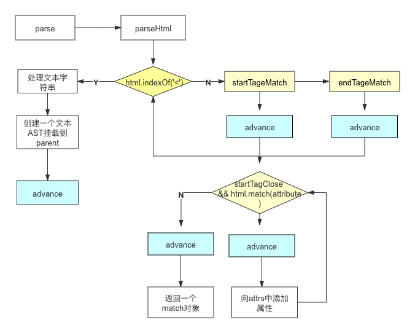

### 摘要
>为了更直观的去学习vue模版编译的过程，这篇文章主要是以编译的主要流程为出发点，没有具体的扣一些细节。由于解析的过程比较复杂，文章省略掉一些`指令`、`事件`...的解析过程，了解了大致的编译流程，我们再来分析源码就比较游刃有余啦！
#### 编译的主要入口
```js
export const createCompiler = createCompilerCreator(function baseCompile (
  template: string,
  options: CompilerOptions
): CompiledResult {
  const ast = parse(template.trim(), options)
  optimize(ast, options)
  const code = generate(ast, options)
  return {
    ast,
    render: code.render,
    staticRenderFns: code.staticRenderFns
  }
})
```
&nbsp;&nbsp;&nbsp;&nbsp;由上述入口函数可比较清楚的知道，`vue`模版编译的三个很重要的过程，`parse`、`optimize`、`generate`,最终返回的是`render`函数;那么我们就来看看这三部曲的具体实现逻辑；
### 编译的第一步——模版解析成ast语法树
&nbsp;&nbsp;&nbsp;&nbsp;以下面的代码为例：
```html
<div id="app">xxxx {{msg}} {{arr}} hello world 
    <p>
        hello world {{age}}
    </p>
</div>
```
&nbsp;&nbsp;&nbsp;&nbsp;转成的ast大致为：
```js
{
  tag:'div',
  type:1,
  attrs:[
    {
      name:'id',
      value:'app'
    }
  ],
  children:[
    {
      text:'xxxx{{msg}}{{arr}}helloworld',
      type:3
    },
    {
      tag:'p',
      type:1,
      children:[
        {
          text:'helloworld{{age}}',
          type:3
        }
      ],
      parent// div ast element
    }
  ],
  parent:null
}
```
&nbsp;&nbsp;&nbsp;&nbsp;vue对于template字符串模版的解析主要是通过正则匹配以及字符串的截取；所使用到的一些正则如下：

```js
//字母a-zA-Z_ - . 数组小写字母 大写字母  
const ncname = `[a-zA-Z_][\\-\\.0-9_a-zA-Z]*`; // 标签名
// ?:匹配不捕获   <aaa:aaa>
const qnameCapture = `((?:${ncname}\\:)?${ncname})`;
// startTagOpen 可以匹配到开始标签 正则捕获到的内容是 (标签名)
const startTagOpen = new RegExp(`^<${qnameCapture}`); // 标签开头的正则 捕获的内容是标签名
// 闭合标签 </xxxxxxx>  
const endTag = new RegExp(`^<\\/${qnameCapture}[^>]*>`); // 匹配标签结尾的 </div>
// <div aa   =   "123"  bb=123  cc='123'
// 捕获到的是 属性名 和 属性值 arguments[1] || arguments[2] || arguments[3] //三种情况 双引号 无引号 单引号
const attribute = /^\s*([^\s"'<>\/=]+)(?:\s*(=)\s*(?:"([^"]*)"+|'([^']*)'+|([^\s"'=<>`]+)))?/; // 匹配属性的
// <div >   <br/>
const startTagClose = /^\s*(\/?)>/; // 匹配标签结束的 >
// 匹配动态变量的  +? 尽可能少匹配
const defaultTagRE = /\{\{((?:.|\r?\n)+?)\}\}/g
```
&nbsp;&nbsp;&nbsp;&nbsp;准备工作就绪，现在就开始我们的`parseHTML`(这里只考虑闭合标签跟文本),如下代码：

```js
export function parseHTML(html) {
    let root;
    let currentParent;
    let stack = [];
    function createASTElement(tagName,attrs){
        return {
            tag:tagName,
            attrs,
            children:[],
            parent:null,
            type:1
        }
    }
    function start(tagName, attrs) { 
        let element  = createASTElement(tagName,attrs);
        if(!root){
            root = element;
        }
        currentParent = element;
        stack.push(element);
    }
    function end(tagName) { 
        let element = stack.pop();
        currentParent = stack[stack.length-1];
        if(currentParent){
            element.parent = currentParent;
            currentParent.children.push(element);
        }
    }
    function chars(text) {
       text = text.replace(/\s/g,'');
       if(text){
        currentParent.children.push({
            type:3,
            text
        })
       }
    }
    while (html) {
        let textEnd = html.indexOf('<');
        if (textEnd == 0) {
            const startTageMatch = parseStartTag();

            if (startTageMatch) {
                start(startTageMatch.tagName,startTageMatch.attrs)
            }
            const endTagMatch = html.match(endTag);

            if (endTagMatch) {
                advance(endTagMatch[0].length);
                end(endTagMatch[1])
            }
        }
        let text;
        if (textEnd > 0) {
            text = html.substring(0, textEnd); 
            chars(text);
        }
        if (text) {
            advance(text.length);
        }
    }

    function advance(n) {
        html = html.substring(n);
    }

    function parseStartTag() {
        const start = html.match(startTagOpen); 
        if (start) {
            const match = {
                tagName: start[1],
                attrs: []
            }
            advance(start[0].length);
            let end, attr;
            while (!(end = html.match(startTagClose)) && (attr = html.match(attribute))) {
                advance(attr[0].length);
                match.attrs.push({ name: attr[1], value: attr[3] || attr[4] || attr[5] })
            };
            if (end) {
                advance(end[0].length);
                return match;
            }
        }
    }

    return root;

}
```
  &nbsp;&nbsp;&nbsp;&nbsp;这里的html参数如果没有`render`、`template`，则会取`vm.$el.outerHTML`获取模版字符串；首先对我们的模版字符串进行"<"匹配，如果`textEnd`等于0，则再进行通过正则匹配是否为开始标签。如果是那么我们就将`html`字符串进行向前截取；若`html.match(startTagClose)`匹配到不是最后的结束标签并且` html.match(attribute)`存在,就要对属性进行提取，以及字符串向前进位截取；直到匹配到结束标签为止。如果`textEnd`大于0，则表示标签前有一段文本(这里暂且不考虑注释节点)，那么我们就走`chars`这个方法,向`currentParent`添加children ast元素节点；这里的`currentParent`保存了当前的父ast元素节点。<br/>
  &nbsp;&nbsp;&nbsp;&nbsp;在绑定父子关系时候，这里有个挺有意思的实现逻辑：
  ```js
  function start(tagName, attrs) { 
      let element  = createASTElement(tagName,attrs);
      if(!root){
          root = element;
      }
      currentParent = element;
      stack.push(element);
  }
  function end(tagName) { 
      let element = stack.pop();
      let parent = stack[stack.length-1];
      if(parent){
          element.parent = parent;
          parent.children.push(element);
      }
  }
  ```
  &nbsp;&nbsp;&nbsp;&nbsp;解释下这块的逻辑：在匹配到开始标签后将这个match对象压入到一个stack中，当下一次再次匹配到一个开始标签时候，也会将这个子标签压入到stack中，当我们匹配到这个子标签的结束标签的时候；我们把stack中的最后的一项移除，这时候父标签对像就是取`stack[stack.length-1]`，最后进行相互绑定就好啦。这里就是`parseHTML`的大致逻辑啦，源码中的处理情况较多，但大致的流程就是这样的；

  ;
  ### 编译的第二步——ast语法树的静态标记
  1. 为什么要进行静态标记<br/>
&nbsp;&nbsp;&nbsp;&nbsp;我们知道vue是通过数据驱动视图的更新，被检测数据一旦发生了变化，对应的触发`Vue._update`方法；但是我们在vue模版中并不是所有的数据都是响应式的，有些可能就是单纯的文本；这些生成的DOMOM以后也不会发生变化的；所以vue做了一些优化，如果被标记了是静态节点就不会进行新旧VNode对比；
2. 如何标记<br/>
首先我们看下vue源码中`optimize`的入口函数为：
```js
export function optimize (root: ?ASTElement, options: CompilerOptions) {
  if (!root) return
  isStaticKey = genStaticKeysCached(options.staticKeys || '')
  isPlatformReservedTag = options.isReservedTag || no
  // first pass: mark all non-static nodes.
  markStatic(root)
  // second pass: mark static roots.
  markStaticRoots(root, false)
}
```
由以上的入口函数可知，我们在`optimize`中做了两件事，第一件事是遍历每个ast元素节点标记静态节点`markStatic(root)`,第二件事就是标记静态根节点`markStaticRoots(root, false)`;
- 标记静态节点
```js
function markStatic (node: ASTNode) {
  node.static = isStatic(node)
  if (node.type === 1) {
    // do not make component slot content static. this avoids
    // 1. components not able to mutate slot nodes
    // 2. static slot content fails for hot-reloading
    if (
      !isPlatformReservedTag(node.tag) &&
      node.tag !== 'slot' &&
      node.attrsMap['inline-template'] == null
    ) {
      return
    }
    for (let i = 0, l = node.children.length; i < l; i++) {
      const child = node.children[i]
      markStatic(child)
      if (!child.static) {
        node.static = false
      }
    }
    if (node.ifConditions) {
      for (let i = 1, l = node.ifConditions.length; i < l; i++) {
        const block = node.ifConditions[i].block
        markStatic(block)
        if (!block.static) {
          node.static = false
        }
      }
    }
  }
}
function isStatic (node: ASTNode): boolean {
  if (node.type === 2) { // expression
    return false
  }
  if (node.type === 3) { // text
    return true
  }
  return !!(node.pre || (
    !node.hasBindings && // no dynamic bindings
    !node.if && !node.for && // not v-if or v-for or v-else
    !isBuiltInTag(node.tag) && // not a built-in
    isPlatformReservedTag(node.tag) && // not a component
    !isDirectChildOfTemplateFor(node) &&
    Object.keys(node).every(isStaticKey)
  ))
}
```
&nbsp;&nbsp;&nbsp;&nbsp;由以上的源码中可以看出，静态标记就是一个深度遍历的过程，其中`isStatic`给出了几种静态节点的条件；1.单纯的文本、2.有`pre`属性、3.满足以下所有的条件：没有动态绑定值 && 没有`v-if` && 没有`v-for` && 没有使用其他指令 && 不是一个组件 && 是平台保留的标签，非带有 v-for 的 template 标签的直接子节点，&& 节点的所有属性的 key 都满足静态 key；<br/>
`markStatic`中对ast元素节点的子节点进行递归标记中如果节点`ifConditions`不为空，则进行取出`ode.ifConditions[i].block`再进行递归标记；
- 标记静态根
```js
function markStaticRoots (node: ASTNode, isInFor: boolean) {
  if (node.type === 1) {
    if (node.static || node.once) {
      node.staticInFor = isInFor
    }
    // For a node to qualify as a static root, it should have children that
    // are not just static text. Otherwise the cost of hoisting out will
    // outweigh the benefits and it's better off to just always render it fresh.
    if (node.static && node.children.length && !(
      node.children.length === 1 &&
      node.children[0].type === 3
    )) {
      node.staticRoot = true
      return
    } else {
      node.staticRoot = false
    }
    if (node.children) {
      for (let i = 0, l = node.children.length; i < l; i++) {
        markStaticRoots(node.children[i], isInFor || !!node.for)
      }
    }
    if (node.ifConditions) {
      for (let i = 1, l = node.ifConditions.length; i < l; i++) {
        markStaticRoots(node.ifConditions[i].block, isInFor)
      }
    }
  }
}
```
&nbsp;&nbsp;&nbsp;&nbsp;这部分的逻辑根上面类似也是进行递归遍历ast元素节点满足以下条件即可为静态根节点：
```js
 if (node.static && node.children.length && !(
      node.children.length === 1 &&
      node.children[0].type === 3
    )) {
      node.staticRoot = true
}
```
&nbsp;&nbsp;&nbsp;&nbsp;以上就是我们的`optimize`优化过程了，另外即将问世的vue3.x中对这一部分又进行了优化.

### 编译的第三步——generate生成render函数
&nbsp;&nbsp;&nbsp;&nbsp;`generate`函数做的事情就是把parse得到的ast解析成一个用`with`包裹的代码段,以上述的例子，最后转成的代码是：
  ```js
  `with(this){ 
    return _c("div",{id:"app"},_v("xxxx"+_s(msg)+""+_s(arr)+"helloworld"),_c("p",undefined,_v("helloworld"+_s(age)))) 
}`
  ```
&nbsp;&nbsp;&nbsp;&nbsp;这个返回的代码段字符串其实就是一个字符串拼接而成；其中解释下这个`with`作用:就是在`with(this){...}`包裹的代码块中始终保持是在`this`作用域下；好了，那就让我们看看如何实现的吧：
```js
const defaultTagRE = /\{\{((?:.|\r?\n)+?)\}\}/g
function genProps(attrs){ 
    let str = ''
    for(let i = 0; i<attrs.length; i++){
        let attr = attrs[i];
        if(attr.name === 'style'){
            let obj = {};
            attr.value.split(';').forEach(item=>{
                let [key,value] = item.split(':');
                obj[key] = value;
            });
            attr.value = obj;
        }
        str += `${attr.name}:${JSON.stringify(attr.value)},`
    }
    return `{${str.slice(0,-1)}}`;
}
function gen(node){
    if(node.type === 1){
        return generate(node)
    }else{
        let text = node.text;
        if(!defaultTagRE.test(text)){ 
            return `_v(${JSON.stringify(text)})`
        }else{
            let tokens = []; 
            let lastIndex =  defaultTagRE.lastIndex = 0;
            let match,index;
            while(match = defaultTagRE.exec(text)){
                index = match.index;
                tokens.push(JSON.stringify(text.slice(lastIndex,index)));
                tokens.push(`_s(${match[1].trim()})`);
                lastIndex = index + match[0].length
            }
            if(lastIndex < text.length){
                tokens.push(JSON.stringify(text.slice(lastIndex)));
            }
            return `_v(${tokens.join('+')})`
        }
    }
}  
function genChildren(el){
    const children = el.children;
    if(children){
        return children.map(c=>gen(c)).join(',')
    }else{
        return false
    }
}
export function generate(el){
    let children = genChildren(el);
    let code = `_c("${el.tag}",${
            el.attrs.length? `${genProps(el.attrs)}`  : undefined
        }${
            children? `,${children}` :''
        })`;
    return code;
}
```
&nbsp;&nbsp;&nbsp;&nbsp;这里出现的`_c`、`_v`、`_s`其实就是在`Vue`上的几个原型方法`createElement`、`createTextVNode`、对象转成字符串；整个的逻辑就是递归遍历这个`ast`语法树进行拼接；这里注意下这个方法`gen`,`gen`的方法对文本进行查找是否含有`{{}}`进行分情况处理，纯文本的话就返回`_v(${JSON.stringify(text)})`,反之，则进行依次查找匹配`defaultTagRE.exec(text)`,匹配到就把`_s(${match[1].trim()})`添加到`tokens`，文本就直接添加到`tokens`，最后进行`join`拼接就好了；文章到这里模版编译的过程也就基本告一段落了；<br/>
参考文章：<br/>
[黄轶-标记静态节点](https://ustbhuangyi.github.io/vue-analysis/v2/compile/optimize.html#%E6%A0%87%E8%AE%B0%E9%9D%99%E6%80%81%E8%8A%82%E7%82%B9)<br/>
[珠峰训练营-模板编译](http://www.zhufengpeixun.com/jiagou/vue-analyse/one.html#%E4%B8%89-%E6%A8%A1%E6%9D%BF%E7%BC%96%E8%AF%91)<br/>
[vue源码训练项目地址](https://github.com/774848686/vue-source)<br/>

